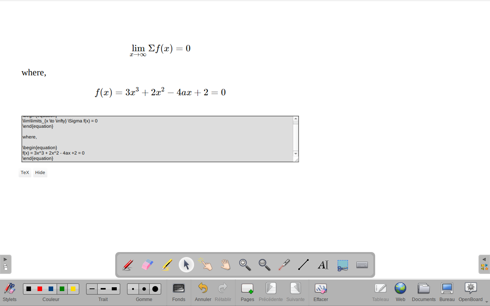

# TeX2Board
OpenSankoré/OpenBoard version >= 1.7.0 LaTeX widget

Installer le dossier TeX2Board.wgt complet dans le dossier des applications OpenBoard.

Pour Linux, dans le dossier ~/.local/share/OpenBoard/interactive content/

Pour Windows, dans le dossier C:\Users\\(nom de l'utilisateur)\AppData\Local\OpenBoard\interactive content\

Remarque : Pour fonctionner, le widget utilise la bibliothèque logicielle JavaScript MathJax qui nécessite une connexion InterNet.

Basé sur la documentation https://github.com/OpenBoard-org/OpenBoard/wiki/The-Web-Widgets-API

