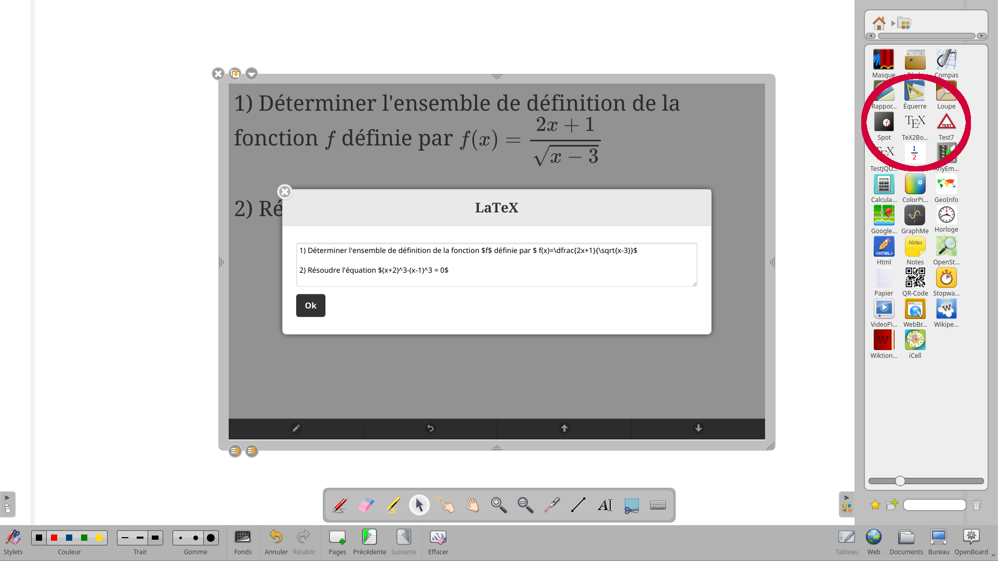

# TeX2Board
OpenSankoré/OpenBoard LaTeX widget

Installer le dossier TeX2Board.wgt complet dans le dossier des applications OpenBoard.

Linux : sudo cp -R TeX2Board.wgt /opt/openboard/library/applications/

Remarque : Pour fonctionner, le widget utilise la librairie MathJax et nécessite une connexion InterNet.

